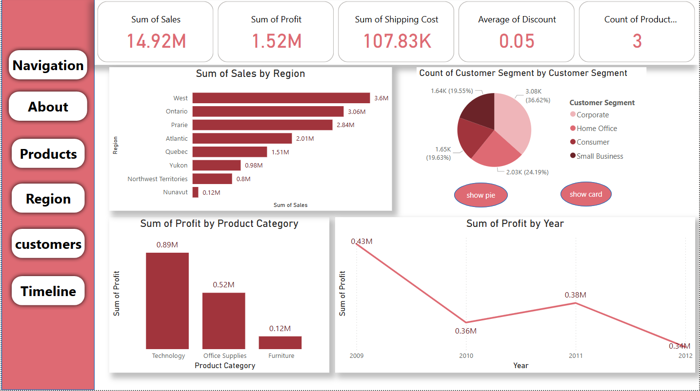
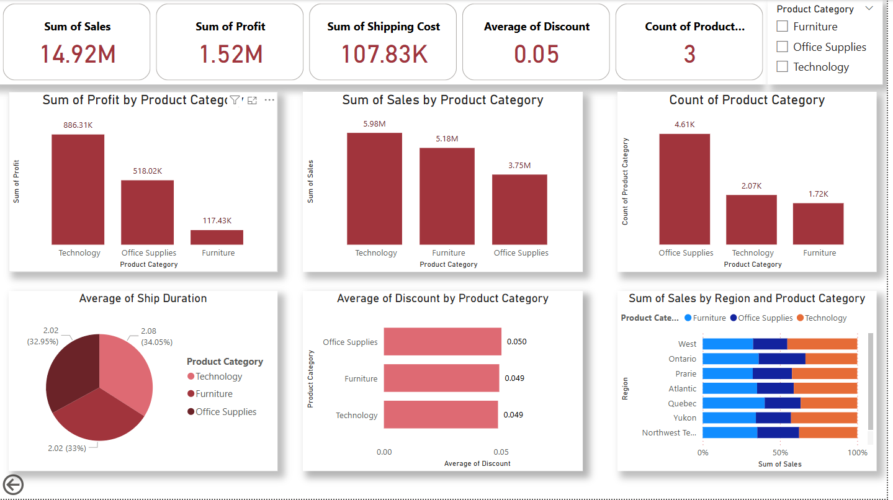
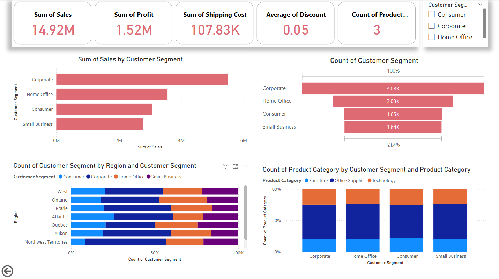

# Sales-Dashboard# Business Analytics Dashboards 📊

This repository contains a set of three dashboards designed to analyze sales data from different perspectives: general performance, product categories, and customer segments. The dashboards include consistent KPIs to provide a comprehensive view of business performance.

---

## 📌 Common KPIs Across All Dashboards
- **Total Sales:** 14.92M
- **Total Profit:** 1.52M
- **Shipping Cost:** 107.83K
- **Average Discount:** 5%
- **Product Count:** 3

---

## 📊 Dashboard 1: General Sales Overview

### Description:
A general summary dashboard providing an overview of sales distribution across regions, product categories, and customer segments, along with yearly profit trends.

### Visualizations Include:
- Sales by Region
- Profit by Product Category
- Customer Segment Distribution
- Yearly Profit Trend

---

## 🛍️ Dashboard 2: Product Category Analysis

### Description:
Focuses on insights related to product categories such as Technology, Office Supplies, and Furniture. It helps understand which categories contribute most to profit and sales.

### Visualizations Include:
- Profit by Product Category
- Sales by Product Category
- Ship Duration
- Product Category
- Discount by Product Category

---

## 👥 Dashboard 3: Customer Segment Insights

### Description:
Analyzes customer segments like Consumer, Corporate, Home Office, and Small Business, showing their contribution to sales and profit.

### Visualizations Include:
- Sales by customer_segment
- customer_segment
- customer_segment by Region 
- Product Category by customer_segment

---

## 🎯 Objective

These dashboards aim to:
- Provide strategic business insights
- Identify high-performing segments and categories
- Help in data-driven decision making

---

